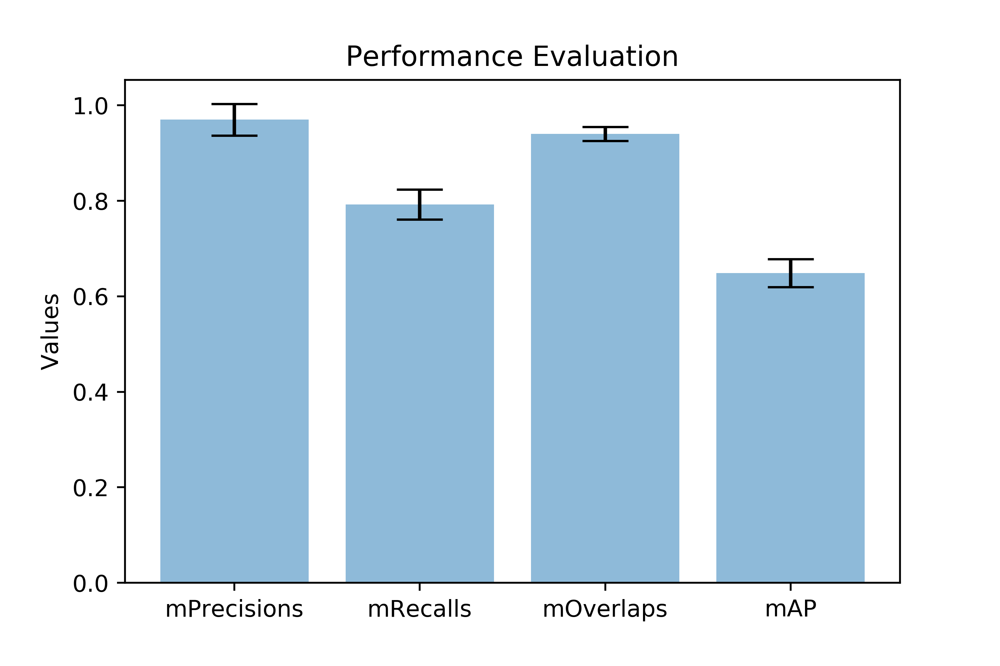

# NMC Particle Detection and Segmentation in X-ray Nano-tomography Images of Lithium-Ion Battery Cathodes

This is an implementation of [Mask R-CNN](https://arxiv.org/abs/1703.06870) on Python 3, Keras, and TensorFlow, for the instance segmentation of Ni0.33Mn0.33Co0.33 (NMC) particles in Lithium-ion battery cathodes. 

The model generates bounding boxes and segmentation masks for each instance of an object in the image. It's based on Feature Pyramid Network (FPN) and a ResNet101 backbone.


The repository includes:
* Pre-trained weights
* Training code for new datasets
* Jupyter notebooks to visualize the detection pipeline at every step

*New model considering the shape characteristics of NMC particles is coming, stay tune.*

## Installation
1. Clone this repository via `git clone https://github.com/hijizhou/LIBNet.git`
2. Install dependencies and current repo
```bash
    pip install -r requirements.txt
```
3. Run setup from the repository root directory
```bash
    python3 setup.py install
```
4. From the [Releases](https://github.com/hijizhou/LIBNet/releases) page, download `mask_rcnn_particles.h5` from the section `Pretrained Mask R-CNN model and example data`. Save it in the `model` directory of the repo.
5. (Optional) Download `example_data.zip`. Unzip it such that it's in the path `data/example/`.

## Run Jupyter notebooks
### Quick demo
Open the `quick_demo_particle.ipynb`. You can use the `example data` to see the detection and segmentation results by the pre-trained model.


### Inspection of training data
Open the `inspect_training_data_particle.ipynb`. You can use these notebooks to explore the dataset and run through the detection pipeline step by step.

### Inspection of pre-trained model
Open the `inspect_pretrained_model_particle.ipynb`.  This notebook goes in depth into the steps performed to detect and segment particles. It provides visualizations of every step of the pipeline.

##### Performance evaluation



## Training on your own dataset

I used [VGG Image Annotator (VIA)](http://www.robots.ox.ac.uk/~vgg/software/via/) for the labeling, see this [blog](https://engineering.matterport.com/splash-of-color-instance-segmentation-with-mask-r-cnn-and-tensorflow-7c761e238b46) for the detailed instruction with an example.

Train a new model starting from pre-trained weights
```
python3 particles.py train --dataset=/path/to/your/dataset --weights=model/mask_rcnn_particle.h5
```

Train a new model starting from ImageNet weights
```
python3 particles.py train --dataset=/path/to/your/dataset --weights=imagenet
```

Train a new model starting from COCO weights
```
python3 particles.py train --dataset=/path/to/your/dataset --weights=coco
```

## Citation
Use this bibtex to cite this repository:
```
@misc{jiang_lib_segmentation2020,
  title={Machine-Learning-Revealed Statistics of the Particle-Carbon/Binder Detachment in Li-Ion Battery Cathodes},
  author={Z. Jiang, J. Li, Y.Yang, L. Mu, C. Wei, X. Yu, P. Pianetta, K. Zhao, P. Cloetens, F. Lin and Y. Liu},
  year={2020},s
}
```

## Contributing
Contributions to this repository are always welcome. Examples of things you can contribute:
* Accuracy Improvements. A more accurate model based on the shape characteristic is coming.
* Training on your own data and release the trained models.
* Visualizations and examples.

## Requirements
Python 3.6, TensorFlow 1.3, Keras 2.0.8 and other common packages listed in `requirements.txt`.


