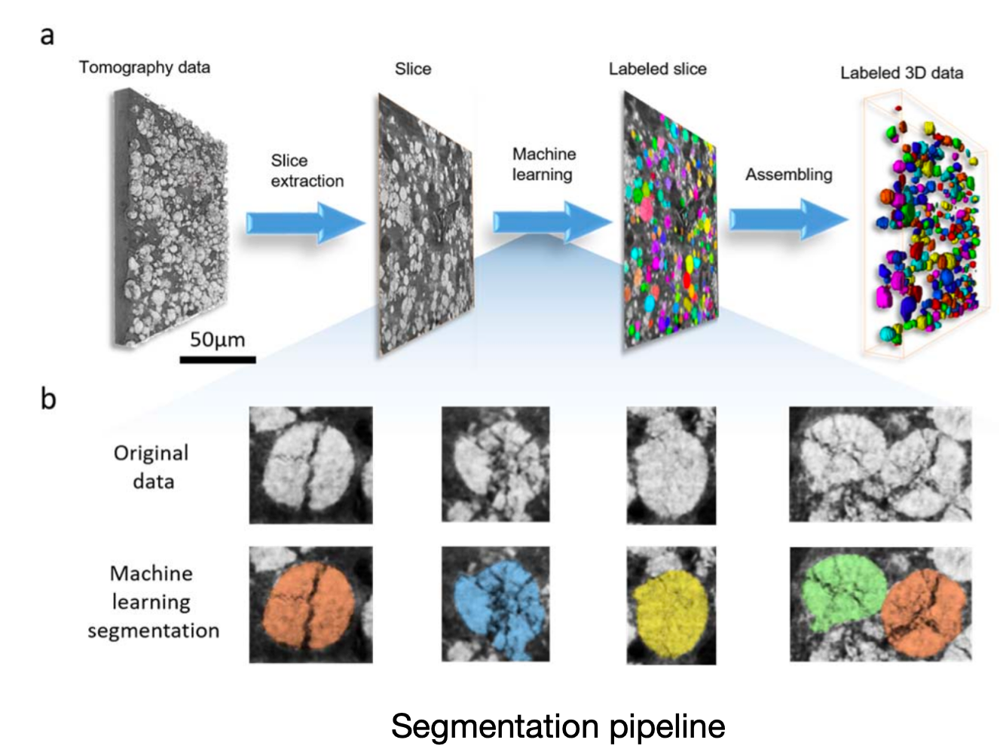

# NMC Particle Detection and Segmentation in X-ray Nano-tomography Images of Lithium-Ion Battery Cathodes

This is an implementation of [Mask R-CNN](https://arxiv.org/abs/1703.06870) on Python 3, Keras, and TensorFlow, for the instance segmentation of Ni0.33Mn0.33Co0.33 (NMC) particles in Lithium-ion battery cathodes. 

The model generates bounding boxes and segmentation masks for each instance of an object in the image. It's based on Feature Pyramid Network (FPN) and a ResNet101 backbone.



The repository includes:
* Pre-trained weights
* Training code for new datasets
* Jupyter notebooks to visualize the detection pipeline at every step

*New model considering the shape characteristics of NMC particles is coming, stay tune.*

## Installation
From the [Releases page](https://github.com/hijizhou/LIBNet/releases) page:
1. Download `mask_rcnn_particles.h5` from the section `Pretrained model v0.1`. Save it in the `model` directory of the repo.
2. Download `example_data.zip`. Unzip it such that it's in the path `data/example/`.

## Apply color splash using the provided weights
Apply splash effect on an image:

```bash
python3 balloon.py splash --weights=/path/to/mask_rcnn/mask_rcnn_balloon.h5 --image=<file name or URL>
```

Apply splash effect on a video. Requires OpenCV 3.2+:

```bash
python3 balloon.py splash --weights=/path/to/mask_rcnn/mask_rcnn_balloon.h5 --video=<file name or URL>
```


## Run Jupyter notebooks
Open the `inspect_balloon_data.ipynb` or `inspect_balloon_model.ipynb` Jupter notebooks. You can use these notebooks to explore the dataset and run through the detection pipelie step by step.

## Train the Balloon model

Train a new model starting from pre-trained COCO weights
```
python3 balloon.py train --dataset=/path/to/balloon/dataset --weights=coco
```

Resume training a model that you had trained earlier
```
python3 balloon.py train --dataset=/path/to/balloon/dataset --weights=last
```

Train a new model starting from ImageNet weights
```
python3 balloon.py train --dataset=/path/to/balloon/dataset --weights=imagenet
```

The code in `balloon.py` is set to train for 3K steps (30 epochs of 100 steps each), and using a batch size of 2. 
Update the schedule to fit your needs.

